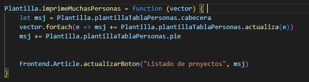

## Práctica 3 Javier Martínez López
* **Nombre:**

  Javier Martínez López

* **Dirección de correo electrónico:**

  jml00059@red.ujaen.es

* **Tablero de Trello:**

    https://trello.com/b/YjYro0ci/pr%C3%A1ctica-3
    
* **HU realizadas:**

    He realizado 3 incrementos distribuidos de manera:
    
    *Incremento 1*
    
        HU1 -> Ver la información del autor/autora de la aplicación al pulsar en el botón “Acerca de”

        HU2 -> Ver un listado solo con los nombres de todos los jugadores/equipos

        HU4 -> Ver un listado con todos los datos de todos los jugadores/equipos

    *Incremento 2*

        HU3 -> Ver un listado solo con los nombres de todos los jugadores/equipos ordenados alfabéticamente

        HU6 -> Ver todos los datos de un determinado jugador/equipo

        HU12 -> Modificar el nombre de un jugador/equipo

    *Incremento 3*
    
        HU8 -> Ver un listado de todos los datos de jugadores/equipos cuyo nombre cumple con un criterio de búsqueda indicado por el usuario

        HU10 -> Ver un listado de todos los datos de jugadores/equipos que cumplen simultáneamente con varios criterios de búsqueda indicados por el usuario para algunos de sus campos. Se deberá poder buscar al menos por 3 campos distintos (además del nombre)

        HU13 -> Modificar varios de los datos a la vez de un jugador/equipo.   Se deberán poder modificar al menos 3 campos además del nombre

* **Tablero de Trello antes:**

      

* **Tablero de Trello después:**

      
    
* **Home de Fauna:**

      

* **Pagina colección de Fauna:**

      

* **Base de datos de Fauna:**

      

* **Datos de la base de datos de Fauna:**

      

* **Documentos creados en la colección:**

    [Documentos creados en la coleccion](coleccion.json)

## Incremento 1
Como he mencionado anteriormente,el incremento 1 constará de:
* **HU1**
     
    
     

    En ms-plantilla -> callbacks.js he modificado:

     

* **HU2**
     
    
     

    Primero,en el ms-plantilla.js implemento:
     

     

     
    
    Y en ms-plantilla -> callbacks.js
     

    Por último, en el index.html, declaro la etiqueta para llamar a la función:
     

* **HU4**
    
    
    

    Como antes, en el ms-plantilla implemento:
    

    

     

    Por último, en el index.html, declaro la etiqueta para llamar a la función:
     

## Incremento 2

Como he mencionado anteriormente, el incremento 2 constará de:
* **HU3**
     

     

    Como antes, en el ms-plantilla implemento:
     

     

     

    Por último, en el index.html, declaro la etiqueta para llamar a la función:
     

* **HU6**
     

     

    Como antes, en el ms-plantilla implemento:
    

    

     

    Por último, en el index.html, declaro la etiqueta para llamar a la función:
    

* **HU12**
    

    

    

    Modifico el nombre de Manuel José Duran por otro.
    
    El país si lo modifico, no se guarda. No lo tengo implementado en guardar(), que a su vez llamará al callbacks.setTodo para modificar sólo el nombre. Posteriormente sí lo añadiré para poder modificar más campos

    

    

    Vemos como se cambia en fauna
    

    En el ms-plantilla he implementado las funciones de recupera, listar2 e imprime.
    

    

    Formulario donde se encuentra la tabla y la funcionalidad de mostar y editar
    

    Comentados el resto para que modifique sólo el nombre
    

    

    En el callbacks implemento:
    

    Por último, en el index:
    

## Incremento 3

Como he mencionado antes, el incremento 3 constará de:
* **HU8**
    

    

    Introduzco un nombre del listado de participantes y pincho en buscar
    

    

    Como antes, en el ms-plantilla implemento:
    

    

    Y en el index el formulario que llame a ambas funciones:
    

* **HU10**
    

    Introducimos un nombre,edad,pais y grupo de un jugador y le damos a buscar
    

    Como antes, en el ms-plantilla implemento:
    

    Y en el index, el formulario que llama a ambas funciones:
    

* **HU13**
    

    

    

    Modificaremos el nombre por otro y el país lo cambiaremos a Austria y la edad a 27
    

    

    Como podemos ver, se guarda en fauna cuando muestro el listado de todos los participantes
    

     En el ms-plantilla he implementado las funciones de recupera, listar2 e imprime.
    

    

    

    Formulario donde se encuentra la tabla y la funcionalidad de mostar y editar
    

    En el callbacks.js para moder modificar los campos nombre,pais,edad,grupo
    

    Lo mismo para guardarlos
    